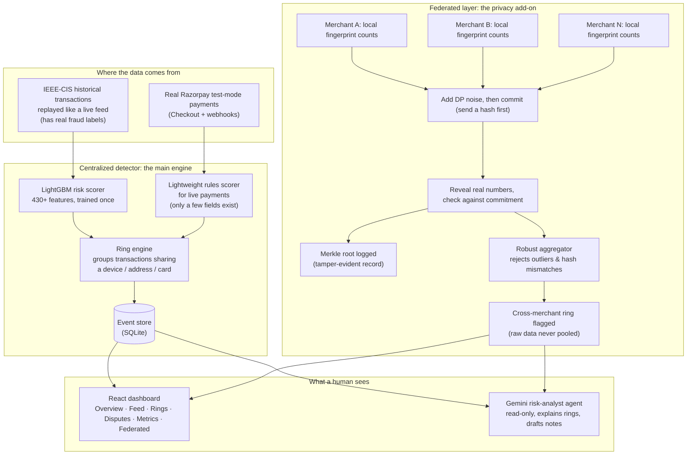

# Project Sentinel

Sentinel catches **coordinated fraud rings**: cases where one person or group
spreads many small transactions across different cards, devices, and merchants
so that no single merchant sees enough to notice. It scores every transaction,
groups the connected ones into a "ring," and shows the whole thing to a human
reviewer. It never blocks a payment on its own.

The original concept/pitch doc is [`project_sentinel.md`](project_sentinel.md),
if you want to see where this started.

> **Defense-only.** Sentinel only advises. It gives every transaction a 0–100
> risk score; anything flagged goes to a human, never to an auto-block. There
> is no code in this repo that can block, freeze, or reverse a payment.

**Video:** [Watch the Sentinel Demo](https://drive.google.com/file/d/12TD_-THouXFWlV4-Dd4ZmMb3I22aQhbL/view?usp=sharing)

**Live Demo:** [Try Sentinel Live](https://project-sentinel-2p5s.onrender.com)

---

## Why this exists, and how it relates to Vulcan

On 18 August 2026, Razorpay launched **Vulcan**, its own AI payments model.
It's trained on roughly 4 billion payments and 3,000 signals per transaction,
and it already spots fraud rings *across* merchants, something a single
merchant looking only at its own data can't do. Razorpay reports an 8x
improvement in catching international-card fraud from it.

Vulcan does this by pulling raw transaction data from many merchants into one
central model. That's a smart design, but it has one structural blind spot:
**it needs everyone to hand over their raw data.** Some organizations can't
do that, no matter how good the model is:

| Who | Why they can't just hand data to a central model |
|---|---|
| Two competing merchants (e.g. rival delivery apps) | Neither will pool raw customer data with the other |
| Banks / NBFCs | Bound by RBI data-localization and data-sovereignty rules |
| Global companies | Bound by GDPR / CCPA-style data rules |

**Sentinel is built for that gap.** Instead of one company collecting
everyone's raw data, each merchant keeps its own data and only shares a small,
noised, cryptographically-checkable summary. A central aggregator combines
those summaries and still finds the same kind of cross-merchant pattern,
without ever seeing a real card number, email, or transaction row from another
merchant. This is done with two techniques, explained in plain English below:
**Federated Learning** and **Differential Privacy**.

Sentinel isn't trying to replace Vulcan or claim Razorpay "missed" something.
Vulcan is already live and working well for the merchants who *can* share
data. Sentinel is the privacy-preserving path for the merchants who can't.

---

## The key ideas, explained simply

You don't need a machine learning background to read this. Here's every
technical term in this project, explained the way you'd explain it to a
friend.

**Fraud ring.** One fraud case is a single bad transaction. A fraud *ring* is
several transactions that are secretly connected: the same stolen card used
through different accounts, or the same phone/laptop ("device fingerprint")
used to create many fake accounts. A ring is much easier to catch than a
single transaction, because the shared thread (device, card, address) gives
it away, *if* someone is looking for that pattern across accounts.

**Federated Learning (FL).** Normally, to train one smart model on data from
5 merchants, you'd copy all 5 merchants' data into one place. FL flips that:
the model travels to the data instead. Each merchant trains a little bit
locally, on its own machine, using only its own data, and then sends back
just the *model's learned adjustments* (a list of numbers), never the raw
transactions. A central server averages everyone's adjustments into one
smarter shared model. No merchant ever sees another merchant's data.

**Differential Privacy (DP) and epsilon (ε).** Even the "just numbers, not
raw data" that FL sends can leak information if you study it hard enough (a
clever attacker can sometimes reverse-engineer facts about the original data
from the model updates). DP fixes this by adding a small amount of random
statistical noise before anything leaves the merchant, so the shared numbers
are useful in aggregate but individually unreliable. **Epsilon (ε)** is the
dial that controls how much noise: a *small* ε (like 1) means a lot of noise
and very strong privacy, but the numbers get less accurate. A *large* ε (like
32) means very little noise, so accuracy stays high but the privacy guarantee
is weaker. There's no free lunch: every real system has to pick a point on
this dial, and we measure exactly what that costs (see Results below) instead
of just claiming "we added privacy."

**Commit-reveal.** A cheating merchant could wait to see what everyone else
is submitting, then craft a fake submission designed to dodge detection.
Commit-reveal blocks this: everyone first sends a **hash** (a short
fingerprint) of their real answer, called a "commitment," *before* anyone
sees anyone else's real answer. Only afterward does everyone reveal their
actual numbers, and the server checks that each revealed answer's hash
matches the commitment sent earlier. If a merchant tries to swap in different
numbers at reveal time, the hashes won't match and it gets rejected. This
stops the "wait and see, then cheat" attack (called a *last-mover* attack).

**Merkle root.** This is just a tidy way to fingerprint a whole batch of
commitments at once. All the merchants' commitment-hashes get paired up and
hashed together, then those results get paired and hashed again, and so on,
until one single hash, the Merkle root, represents the entire round. If even
one merchant's submission were altered afterward, the root would change
completely. It's logged every round as a tamper-evident record (in a
production system it could be published somewhere public, like a timestamping
service, so no one, including the aggregator itself, can quietly edit
history).

**Salted-HMAC fingerprint.** To group transactions across merchants (e.g.
"this device showed up at three different merchants"), you need to compare
device/address identifiers *without* actually revealing them to each other.
An HMAC is a keyed, one-way scramble of a value. Merchants can compare
scrambled fingerprints and see they match, without either one learning what
the real device ID behind it is.

**Byzantine robustness / poisoning.** In any system that combines input from
multiple parties, one party might misbehave, by accident or on purpose (a
"poisoned" or malicious update meant to corrupt the shared result). Byzantine
robustness means the aggregator can spot a submission that looks statistically
wrong (way bigger than everyone else's, or pointing in a suspiciously
different direction) and throw it out before it can damage the shared answer.

---

## Architecture: one diagram



**Reading it:** the top half is the everyday detector. It runs on one
machine, scores every transaction, and groups the connected ones into rings.
The bottom half is the federated experiment. It answers "could 8 separate
merchants, none of whom trust each other with raw data, still catch the same
cross-merchant ring together?" Both feed the same dashboard and the same
chat agent.

---

## Results: the honest numbers

Everything below is measured on a **held-out test set** the models never
touched during training (the final 15% of the dataset's timeline). Numbers
regenerate from scratch with `make reproduce` / `make fl` / `make fl-rings`
(seed 42, always the same result).

### 1. Transaction risk scorer

One LightGBM model reads ~430 features per transaction and outputs a 0–1 risk
score.

| Metric | Value | In plain English |
|---|---|---|
| PR-AUC | 0.546 | Solid ranking ability on a rare-event problem (only 3.5% of transactions are fraud) |
| ROC-AUC | 0.905 | Reliably ranks a fraud transaction above a legitimate one |
| Cost-optimal point | recall **0.84**, precision 0.14 | Catches 84% of fraud; 76% lower total cost than reviewing nothing |

### 2. Ring engine: turning alerts into a short review list

Grouping connected transactions into rings, instead of showing every flagged
transaction on its own:

| Ring type | Precision | Recall | F1 |
|---|---|---|---|
| Device rings | 0.72 | 0.82 | 0.77 |
| Address rings | 0.42 | 0.40 | 0.41 |

This turns **17,835 individual transaction alerts into 144 ring alerts**,
about 124x fewer things for a human to look at, while still covering 17.5%
of all fraud (the coordinated slice; most fraud is a single account acting
alone, which a ring detector was never going to catch, and we say so rather
than hide it).

**One negative result, kept on purpose:** we also tried hand-building 27
ring/entity features directly into the risk model. It moved PR-AUC by
+0.003, within noise. The pre-built dataset columns already carried that
signal. We kept the simpler model and documented the experiment instead of
quietly deleting it. ([full write-up](report/PHASE2.md))

### 3. Federated learning: does going private cost accuracy?

A separate, smaller model (a neural network, since federated averaging needs
a model built that way) is trained two ways: pooling all data centrally, vs.
8 separate simulated merchants training locally and only sharing model
updates.

| Setup | Test PR-AUC |
|---|---|
| Centralized (pools everyone's data) | 0.395 |
| Federated (8 merchants, no data pooled) | 0.384 |

Federated is within noise of centralized. **Not pooling raw data costs
almost nothing here.** ([full write-up, incl. the ε-vs-accuracy curve and the
poisoning defense](report/PHASE4.md))

### 4. Federated cross-merchant ring detection: the core claim

This is the experiment that actually tests project Sentinel's headline claim:
*can 8 merchants find a shared fraud ring together, without pooling raw
transactions?*

| Detector | Precision | Recall | F1 |
|---|---|---|---|
| Centralized (sees every transaction, the "cheating" baseline) | 0.68 | 0.66 | 0.67 |
| **Federated** (DP + commit/reveal + Merkle root + robust aggregator) | **0.68** | **0.66** | **0.67** |

**Identical result.** Same 78 correct catches, same 36 false alarms, same 40
misses, in both. Federating the computation is free. No raw transaction ever
leaves a merchant.

Privacy isn't free, though. That shows up once you turn on differential
privacy noise:

| Privacy budget (ε) | F1 |
|---|---|
| ∞ (no noise at all) | 0.67 |
| 32 | 0.66 |
| 16 | 0.43 |
| 1 (very strong privacy) | 0.08 |

Noise is essentially free down to ε≈32; below ε≈16 it starts erasing small
rings (a ring of 3–4 transactions spread across merchants has very little
signal to begin with, and heavy noise buries it). This gap shrinks as a
merchant's transaction volume grows. At Vulcan's real-world scale, the same
noise would matter far less. ([full write-up](report/PHASE8.md))

**Poisoning test:** one dishonest merchant floods the system claiming every
transaction is high risk. With no defense, F1 drops to 0.34. With the
robust aggregator turned on, that merchant is rejected every single run and
F1 recovers to 0.61.

---

## What broke, and how we fixed it

Nothing here worked on the first try. Some of the more useful failures:

- **The privacy noise made results *worse* as we added more privacy.
  Backwards.** Our first design shared a transaction count and a risk total
  separately, then divided them. Under noise, the two numbers get corrupted
  independently, so dividing them could accidentally *inflate* the result:
  more privacy noise meant *more* false alarms, not fewer. Fix: instead of
  sharing two raw numbers, each merchant reports "how many transactions fell
  into each of 5 risk buckets." A single noised count per bucket behaves
  predictably under noise.

- **Grouping "connected" transactions accidentally grouped almost
  everything.** Our first ring-detection method chained transactions
  together through any shared card or device, but a card *type* (like "Visa
  credit, HDFC Bank") is shared by thousands of unrelated real cards, so the
  chains merged into one 65,000-transaction mega-blob. Fix: stop chaining.
  Only group transactions that share one *specific* device or address,
  capped at a sane group size (2–25 people), much closer to what a real ring
  actually looks like.

- **Adding privacy noise to model training made accuracy collapse to
  near-zero.** The standard training optimizer (Adam) doesn't tolerate the
  noise differential privacy adds; it corrupts Adam's internal running
  averages. Fix: switched to a simpler optimizer built for this (plain
  gradient descent with momentum), and used bigger batches, so the real
  signal outweighs the added noise.

- **The Razorpay tab was fake in spirit.** Early on, real payments through
  Razorpay's checkout weren't actually being scored by the fraud model or
  grouped into rings. The "live" tab was closer to decoration. Fix: built a
  second, lighter detector specifically for real payments, using only the
  handful of fields a real payment actually has (card type, contact info,
  merchant), and made it feed the same ring engine.

- **The chat agent said the federated feature "isn't active."** It wasn't
  lying: its tools only ever looked at the regular live database, so it
  genuinely couldn't see the federated experiment running elsewhere. Fix:
  gave it a fifth tool that reads the federated results directly, and told it
  explicitly what the live feed is (the centralized baseline) versus what the
  federated experiment measures.

- **A hardcoded rule for "what counts as a suspicious model update" rejected
  every single honest participant.** The original design said "reject any
  update too different from the average." In practice, honest updates
  naturally differ a lot from each other once training gets close to a good
  answer, so the fixed rule was throwing out real, honest merchants every
  round. Fix: made the rule relative instead of absolute: compare each
  update to how different updates *typically* are from each other that
  round, not to a single fixed number picked in advance.

More dead ends, with exact numbers and root causes, are logged in
[`DEVLOG.md`](DEVLOG.md) as they happened, including several bugs that had
nothing to do with machine learning at all (a replay clock that ran away from
the actual data, a database that returned stale rows after a restart).

---

## Features, and why they're built this way

- **Two separate data sources feed the same dashboard.** A replay of real,
  labeled historical transactions (so we can actually measure precision and
  recall against ground truth), plus real live Razorpay test-mode payments
  (so the demo is genuinely wired to a real payment gateway, not just a
  recording). They're labeled differently in the UI so it's always clear
  which is which.

- **Live payments get a simpler "rules" score, not the full model.** A real
  Razorpay webhook only carries a handful of fields (amount, card network,
  contact, timestamp), nowhere near the ~430 features the trained model
  needs. Rather than pretend otherwise, live payments get a transparent,
  explainable rules-based score instead, and the dashboard says so.

- **Rings are grouped by exact shared identity, not by chaining.** Chaining
  connections together (this card touched this device, which touched that
  address, which touched...) sounds smarter but blows up into meaningless
  giant groups on real data (see "what broke" above). Simple, capped grouping
  turned out to be both more accurate and easier to explain to a reviewer.

- **The chat agent has zero write access.** It has five tools, and every one
  of them only *reads* from the same database the dashboard reads from. It
  can summarize a situation, explain a ring, or draft an escalation note, but
  it cannot flag, block, or dispute anything itself. A human is always in the
  loop for any action.

- **Nothing in this system auto-blocks a payment.** Every score, every ring,
  every agent output ends at "here's a review item for a human," on purpose.
  This is meant to be a risk *manager's* tool, not an automated judge.

- **Negative results are kept, not deleted.** The hand-built ring features
  that didn't move accuracy (see Results #2) are still in the repo and still
  documented, because an honest "we tried this and it didn't help" is more
  useful than a resume with only the parts that worked.

---

## Try it yourself

```bash
brew install libomp                 # LightGBM's OpenMP runtime (macOS)
make venv                           # Python 3.14 venv + pinned dependencies
export SENTINEL_DATA_DIR=/path/to/ieee-fraud-detection
make reproduce                      # -> report/metrics.json, report/ring_metrics.json
```

See [`data/README.md`](data/README.md) for where to get the dataset (free,
via Kaggle).

```bash
make backend                        # FastAPI service, needs `make baseline` first
cd frontend && npm install && npm run dev    # dashboard at http://localhost:5173
```

The two federated experiments are optional and separate from the main
reproduce step:

```bash
make fl-deps && make fl             # Phase-4 federated classifier -> report/fl_metrics.json
make fl-rings                       # Phase-8 federated ring detector -> report/fl_ring_metrics.json (~1 min)
```

More detail: [`backend/README.md`](backend/README.md) (API + how the backend
is put together) and [`frontend/README.md`](frontend/README.md) (dashboard
tabs and what each one shows).

---

## Project layout

```
data/prepare_splits.py    splits the dataset by date, never shuffled (no peeking at the future)
train/baseline.py         trains the main risk scorer          -> report/metrics.json
train/ring_engine.py      groups transactions into rings       -> report/ring_metrics.json
train/ring_features.py    the hand-built ring features (kept as a documented negative result)
train/fl_*.py             the federated classifier experiment  -> report/fl_metrics.json
train/fl_crypto.py        commit/reveal, Merkle root, HMAC fingerprints, DP noise (dependency-free)
train/fl_rings.py         federated vs. centralized ring detection -> report/fl_ring_metrics.json
backend/app/              FastAPI service: scoring, rings, replay, Razorpay, agent, federated endpoints
frontend/src/              React dashboard
report/                   every generated number, plus a plain write-up per experiment
```

---

Want the raw, blow-by-blow version of everything above, every decision, every
bug, every dead end, in the order it actually happened? That's [`DEVLOG.md`](DEVLOG.md).
